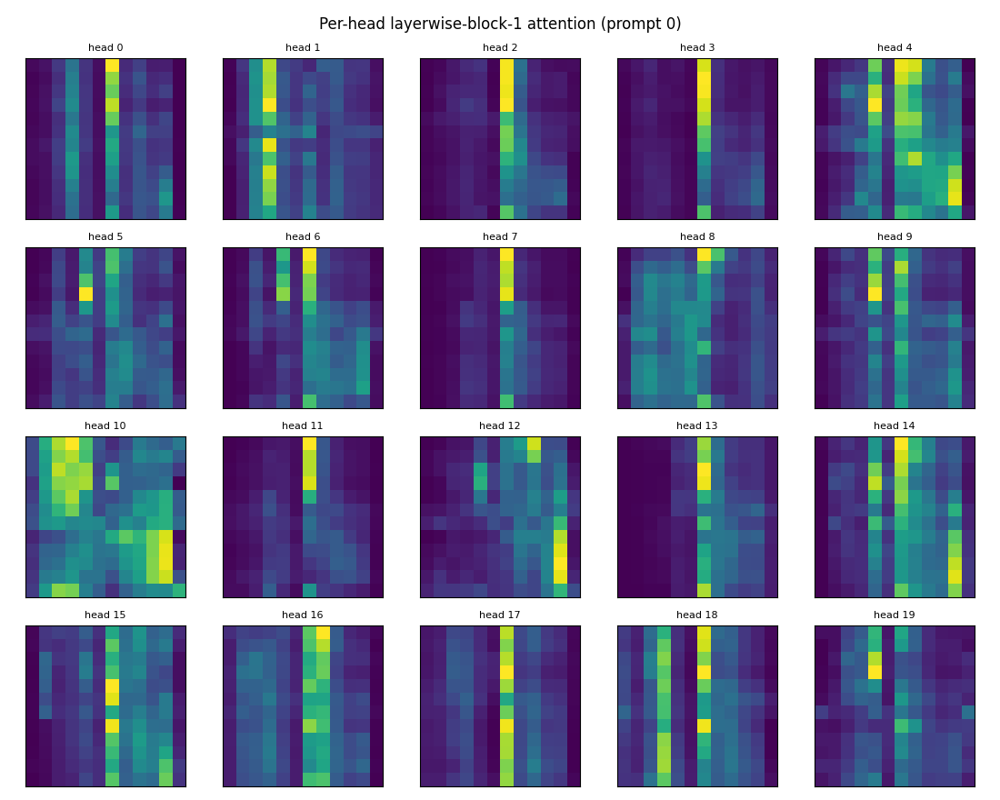
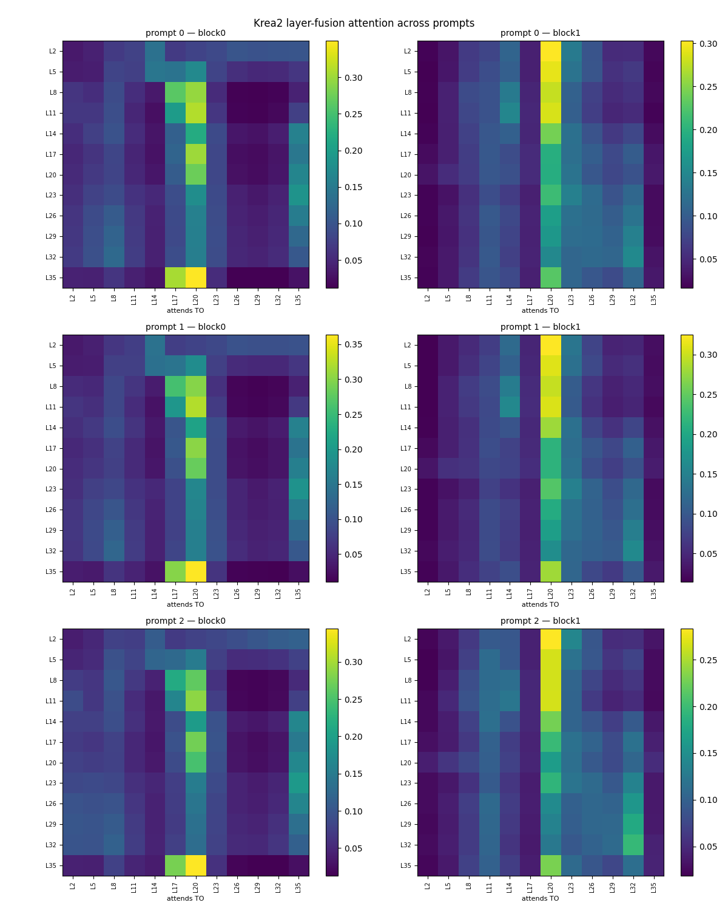
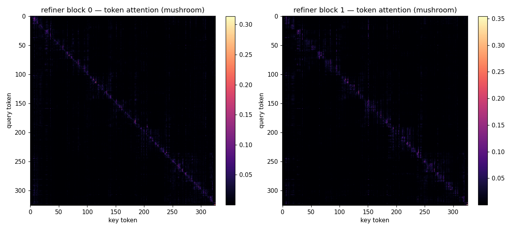
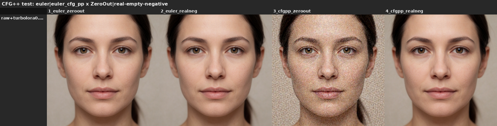

# Findings — Krea 2 conditioning probes (layers · fusion · steering)

Last updated: 2026-06-29

**Headline:** Krea 2's text conditioning is **steerable** — most cleanly from the *prompt side* (a `<think>`
block acts as a steering vector), and also by editing the learned layer-fusion. Under the hood, the 12 encoder
layers fuse through a measured **L20 attention hub** and a **contrastive "mid-minus-deep" projector**. The
results below are grouped into three themes (figures inline under each section):

- **What each selected layer carries** — the solo / leave-one-out layer probes (the TLDR table below), the
  cross-style check, and an honest novelty calibration.
- **How the 12 layers fuse into one vector** — the layer-fusion attention (the L20 hub + contrastive
  projector), attributes through the fusion, and the projector-LoRA A/B.
- **Steering levers** — prompt-side `<think>`, the Turbo-LoRA strength dial, the two-sampler split, and
  labeled-axis steering.

---

## Theme A — what each selected layer carries (solo / leave-one-out probes)

Basis: solo (keep-one) + leave-one-out (drop-one) sweeps on **one prompt** (portrait), seed 42,
Krea2 **Turbo fp8**, 8 steps euler/simple, image-level **RGB-RMS** distance. Cross-style sweeps
(anime, illustration) are done — see the Cross-style update below.

| # | Finding | Confidence | Why / caveat |
|---|---------|-----------|--------------|
| 1 | **Deep selected layers carry the renderable content; shallow are scaffolding.** Solo L23/L26/L29/L32 each render a coherent portrait alone; L2–L11, L17, L20 alone → noise. | **High** (this prompt) / Medium (general) | Agrees with the learned projector (deep layers have the largest \|weights\|) and the tech report ("final layer optimized for next-token prediction, not image gen"). Generality confirmed by the cross-style sweep (below). |
| 2 | **L14 carries structure/layout** (first read as "text/typography"). Solo L14 → text glyphs in the portrait, road/scene structure in the illustration. | **Medium-High** | Refined by the cross-style sweep (below): not purely text — structure/layout. Clean single-layer signal that holds across styles. |
| 3 | **The final layer (L35) alone is unusable for image gen** (noise). | **High** | Directly confirms the tech report's rationale for multilayer aggregation. |
| 4 | **Necessity ≠ sufficiency: deep layers are partly redundant.** Drop-one keeps everything coherent (11 layers remain). L29 most necessary (Δ=0.35), then L32 (0.25), L23 (0.20); **L26 is sufficient-alone but low drop-importance (0.15) → redundant.** | **Medium** | Ranking from a coarse RGB-RMS metric, one prompt/seed. Direction (deep > shallow) trustworthy; exact order (e.g. L29 vs L32) low confidence. |
| 5 | **The model's learned aggregation agrees with the ablations.** Largest-\|weight\| layers (L23, L29, L32, L26) are the ones that render alone and/or matter most when dropped. | **Medium-High** | Two independent signals cross-check (learned projector vs causal ablation). |

### Confidence summary

- **High:** deep-carry-content / shallow-scaffold / final-layer-unusable — architecturally grounded + visually unambiguous.
- **Medium:** L14 = structure/layout (refined from an initial "text" read); redundancy among deep layers.
- **Low:** exact importance ordering (coarse metric, n=1 prompt/seed).
- **Done:** cross-style generality — the pattern held across photo / anime / illustration (see Cross-style update below).
- **Pending:** precise numbers (conditioning-space leave-one-out + gain-Jacobian via the `txtfusion` extractor, no generation needed).

### Caveats bounding all of the above

Single prompt, single seed, Turbo **fp8** (quantized), **image-level** RGB-RMS distance (not perceptual,
not conditioning-space). These bound confidence; the extractor + cross-style sweeps are how we tighten it.

### Cross-style update (2026-06-26)

Ran solo + leave-one-out on **anime** and **illustration** too. The pattern **held across all 3 styles**:
deep layers (L23/26/29/32) render alone, shallow = noise, and the leave-one-out ranking is consistent
(L29 top everywhere; cluster {L29, L23, L32} then L26/L14; shallow lowest). L14 **refined**: it carries
**structure/layout** (text glyphs in the portrait, road/scene structure in the illustration), not purely
"text". Cross-style consistency moves findings 1 & 3 toward **High**.

### Is any of this novel? (honest calibration)

Mostly **expected**, and worth saying plainly:
- "deep = semantic, shallow = lexical/scaffold" is standard LLM-layer interpretability.
- "final layer unusable for image-gen" is *literally Krea's stated reason* for multilayer aggregation —
  confirmatory, not a discovery.
- redundancy across adjacent layers is normal.

So the solo/LOO work is **verification + reproducible artifacts + the (mild) L14/structure observation** —
not a discovery. The genuinely model-specific questions it raised — now **addressed** below:
1. **The combination mechanism** — answered: the layer-fusion routes through an **L20 directional hub**
   (see "Layer-fusion attention"). ✓
2. **Attribute-level** — answered: benign attributes (expression, sheen, blush) **survive the aggregation**,
   and the projector/fusion is *not* where they're gated (see "Attributes vs the projector-rebalance lever"). ✓
3. **Where the bias lives** — answered: the encoder is **frozen stock `Qwen/Qwen3-VL-4B-Instruct`** (Krea's
   loading code does `from_pretrained` + `.eval().requires_grad_(False)`; its config is field-for-field
   identical to stock), so all learned aggregation is **DiT-side**. ✓

## Theme B — how the 12 layers fuse into one vector

### Layer-fusion attention — measured behavior (2026-06-26)

Built the `txtfusion` extractor (CPU; loads the Krea2 CLIP for the 12 hidden states + the DiT's txtfusion
weights, recomputes the layerwise attention).

**What's documented vs measured (honest framing):** the *architecture* — cross-layer attention over the 12
layers, then a `Linear(12→1)` projector — is public (diffusers' `transformer_krea2.py` docstring: "the
layerwise_blocks attend across the num_text_layers axis"). We did **not** discover that. What's measured
below is the *learned behavior* of that attention (which layer it concentrates on, the sign pattern of the
learned projector) — emergent properties no source states. This is characterization of an open model, not
an architecture reveal:

*The two layerwise attention blocks (avg over tokens + heads) and the learned projector. The bright L20 column
in block 1 is the hub; the projector is "mid minus deep" (positive L8–L20, negative L23/29/32).*

1. **L20 is a universal attention hub.** In layerwise block 1, nearly every selected layer attends to L20;
   column-strength L20 = **0.24 / 0.27 / 0.25** across portrait / anime / illustration (~2x the next, L23),
   with a near-identical ranking. Cross-style consistent → **High confidence**, a prompt-independent
   architectural property. Per-head: the hub is **broad** (most of the 20 heads route to L20), with a
   minority specializing on L14 / L23-29 / L35 / L8.
   - **Validated (2026-06-26):** also held on 2 long dense prompts (mushroom, geisha). **Content-token-masked**
     (dropping the 34-token template prefix + suffix), L20 is the top key-layer for **91–95% of content
     tokens** → content-driven, **not** a padding/template artifact. 5 prompts total now.
   - **Mechanism: a learned *directional* hub, not a magnitude sink.** L20's hidden-state norm is mid-pack
     (rank 6/12) and its raw (pre-norm) key norm is near-*lowest* (rank 10/12); the block's `qknorm`
     equalizes every layer's key magnitude. So routing is decided by learned query/key **direction** (trained
     `wq`/`wk` point most queries at L20's key direction), not magnitude — and not a hardcoded index (the
     layerwise blocks have no positional encoding). Encoder hidden-state norm grows ~48x L2→L35 (11→555),
     which may be *why* the projector down-weights deep layers.
2. **The projector is contrastive, not an average.** Learned 12->1 weights are positive on mid layers
   (L8-L20, peak L14 +0.71) and strongly negative on deep layers (L23 -1.44, L29 -0.89, L32 -0.61). Fixed
   weights → prompt-independent. The final text vector ≈ "mid minus deep". **High confidence.**

Caveat: the projector's signed weights act on the attention-**mixed** slots (post block 0/1), not raw layers.

*Per-head block-1 attention (20 heads). The hub is **broad** — most heads route to L20 — with a few
specialists elsewhere, so the concentration is not one rogue head.*

*The same attention, three prompts × {block 0, block 1}. The L20 hub (the bright block-1 column) holds across
photo / anime / illustration — a prompt-independent property, not a one-prompt artifact.*

**Refiner blocks (mapped) + RAW check (2026-06-26):** the 2 refiner blocks (token attention, post-projector)
do **local, diagonal-dominant token self-attention** — each token attends mainly to itself + near neighbors
(~27–31% of attention mass within ±8 of the diagonal) over a low global floor, with only a few **weak** hub
tokens (a template token ~#7 + a handful of content tokens, ~3–6× uniform; received-entropy 0.94–0.96 → no
dominant sink). So the refiner does ordinary local token refinement — structurally unlike the layerwise
**L20 layer-hub** (map below). And the whole `txtfusion` is **checkpoint-agnostic**: RAW vs Turbo
projector weights are identical (cosine 1.0, 12/12 signs) and the L20 hub holds on RAW (92–95% of content
tokens). So the L20 hub + contrastive projector are "Krea 2" findings, not "Turbo"-specific.
Data: `data/raw_validation/raw_vs_turbo.json`.

*The 2 refiner blocks (post-projector token attention) are diagonal-dominant local self-attention — each token
attends mostly to itself + near neighbors, with no dominant sink. Structurally unlike the layerwise L20 hub.*

### Attributes vs the projector-rebalance lever (2026-06-26)

Difference-of-means + causal tests on benign attributes (expression, sheen, blush):
- **Conditioning (net-effect through `txtfusion`):** these attributes come through the learned aggregation
  *more* strongly than ordinary content controls (mean relative footprint 0.14 vs 0.04; A=out/in 1.2 vs 0.46).
- **Causal (with/without in the prompt):** each attribute renders clearly on stock Turbo.
- **Stock vs rebalanced (deep-boost projector LoRA, ×1 and ×4):** the attributes render either way. Boosting
  the deep layers mainly shifts **detail / contrast / intensity** — consistent with the deep layers carrying
  fine detail (see Prior work) — rather than changing whether an attribute appears.

So for these benign attributes, presence doesn't hinge on the projector/fusion stage; the rebalance lever
behaves as a detail/intensity knob. Caveats: a few prompts/seeds, controls not magnitude-matched, benign
attributes only (not near-safety-boundary cases), visual + correlational rather than a hard metric.
Data in `data/attribute_directions/` (probe + causal + stock-vs-rebalanced grids).

### Projector-LoRA A/B — result (2026-06-26)

The community hand-rebalances the projector; the trainers can *learn* it (diffusers + musubi target
`text_fusion.projector` by default; ai-toolkit excludes it). Tested whether **training** the 12→1 layer-mix
changes a LoRA: two identical Krea-2-Raw DreamBooth LoRAs (QLoRA/NF4, 5 imgs, 300 steps, rank 16) differing
*only* in whether `text_fusion.projector` is a LoRA target; compared on held-out prompts (RAW, fresh seed).

**Result: at this scale, training the projector made no meaningful difference.** Both arms learned the
subject comparably and neither distorted an unrelated control prompt; differences were within one-seed noise
(a faint hint the with-projector arm kept the scene slightly more faithful on the "beach" prompt, but weak).
So for a small *subject* LoRA, including the projector (diffusers/musubi default) vs freezing it (ai-toolkit)
doesn't much matter — consistent with the projector being a modest lever and the diffusers README's advice to
narrow to attention layers for long runs.

Caveats: quick proof — tiny dataset, 300 steps, rank 16, one validation seed, a *subject* (DreamBooth) LoRA
not a *style* LoRA (where the semantic-depth layer-mix might matter more), NF4-quantized. Doesn't rule out the
projector mattering in a longer or style-focused run. Data: `data/projector_ab/`.

## Theme C — steering levers

### Prompt-side steering: a `<think>` block (or system prompt) as a steering vector (2026-06-27)

Every lever above is a **weight/activation** edit (projector rebalance, single-layer isolation). This one is
**prompt-side**, and it's cleaner.

Turbo's distillation flattens intense expression: prompt for an intense expression (e.g. "furious",
"terrified") and stock Turbo returns a near-neutral face. The community deep-band rebalance lever restores
intensity, but as an *off-distribution* weight edit (it saturates the projector). An *in-distribution*
alternative: prepend a short `<think>` block reasoning about the target expression, injected through the
tokenizer's **skip-template route** — a full `<|im_start|>…<think>…</think>` string passed as the prompt, which
the qwen3vl tokenizer emits verbatim, so no ComfyUI/pipeline edit is needed.

**Result** (Turbo, mu pinned, same seed, 4 expressions × {stock, +think, +deep-band rebalance}): the `<think>`
block restores the flattened expressions **as well as or better than** the deep-band rebalance lever, with
adherence intact — clean photoreal portraits, correct framing/lighting/background, no artifacts, no text
flood, no style drift.

*Same seed (#123); only the column lever changes. The `<think>` block (middle) restores Turbo's
distillation-flattened expression in-distribution, matching or beating the deep-band rebalance lever (right)
without leaving the data manifold. `joyful` (bottom) is a control — it isn't a flattened expression, so it
renders in every column.*

**Mechanism** (CPU probe, no generation): the `<think>` span is a strong, consistent conditioning lever —
~17–24% shift in the 12 selected hidden states, **0.86 direction consistency** across variants, energy
concentrated at **L20/L23** (the same hub the layer-fusion findings land on). It doesn't add new content; it
nudges the existing conditioning along its own dominant axis. Content scales mostly *one* direction
(neutral↔steer cosine 0.87) → a tunable "push harder along the model's own intent" knob, i.e. a steering
vector.

**Reframe.** The think block and the deep-band rebalance lever are not different mechanisms — they are
different **write-points onto one steering direction**, one off-distribution (weights) and one
in-distribution (prompt). `<think>` is a convenient, high-leverage, in-distribution place to write.
Expectation: this should generalize to any axis the encoder already represents (style intensity, detail,
mood), as long as you *push* rather than *teleport*.

**Verified tokenization + the system-turn strip (2026-06-27).** Ran Comfy's *actual* `Krea2Tokenizer` /
`Krea2TEModel` (`comfy/text_encoders/krea2.py`) on the injected string, rather than assuming:
- **Special tokens are tokenized per the model config**, not as literal text. `<think>` → single id 151667,
  `</think>` → 151668, `<|im_start|>` → 151644 (slow-tokenizer check: each encodes to exactly one id). The
  skip-template route (`text.startswith('<|im_start|>')`) hands our raw string straight to the tokenizer, so
  the chat structure is preserved — it is **not** shoved into the user slot or escaped.
- **Krea 2 strips the system turn before the DiT.** `Krea2TEModel.encode_token_weights` finds the *second*
  `<|im_start|>` (the user turn) and slices `out = out[:, :, template_end:]` (then +3 to skip
  `<|im_start|>user\n`). On our string (3 `<|im_start|>` at token idx 0/31/53), the cut lands at idx 34, so
  the entire `<|im_start|>system … <|im_end|><|im_start|>user\n` prefix (34 tokens) is **discarded**; the user
  content + assistant turn (incl. our `<think>…</think>`, 46 tokens) survive. Verified the `<think>` ids are
  on the surviving side.

So **not every position is interchangeable**: the *directly* steerable write-points are the **user turn and
the assistant `<think>` turn** (both survive). A **system-turn** prompt does **not** inject conditioning — its
tokens are sliced off — and can only influence the result **indirectly** (the surviving tokens attended back
over the system prefix during the causal encoder pass). That refines the earlier "system prompts work too":
they may nudge via attention contamination, but they are not a direct write-point the way the think block is.

**Confidence: low–medium** on the visual result — a believable-direction outcome, not a measured effect size
(1 subject, 2 seeds, 4 expressions, single visual read; identity drifted slightly on one cell — steering
moves a bit more than the one attribute you aim at). The tokenization/strip facts above are **high** (runtime
verified). Untested twin: does a system-turn prompt steer *at all* through the indirect path? The named-axis
follow-up this pointed to is **now done** — see **Labeled-axis steering** below: it turns "steering works"
into "steer a *named* axis on purpose, and predict in advance whether it will".

### Labeled-axis steering — what predicts it, and how clean is an axis? (2026-06-29)

Goal: turn "steering works (vaguely)" into "steer a *named* axis on purpose, and predict in advance whether
it will." Measured a difference-of-means direction for four benign axes (smile / detail / wide_shot /
warm_light), characterized each through the real `txtfusion` forward, then amplified each on a neutral base
via the concept-inject node. **Low–medium confidence** (1–2 seeds, visual read). Figures inline below;
harness/prereg internal.

- **Projector pass-through does NOT predict steerability — it's inverted.** A CPU measurement of how much of
  each axis survives the fusion (pre→post-fusion d′) ranked warm_light highest (0.96) and smile lowest
  (0.63); actual amplify-steering strength was the *exact opposite* (smile fires hardest, warm_light barely
  moves). The fusion-separation metric is a dead end for predicting steering.
- **Direction *consistency* (the cheap A/B-pair measure) is the better proxy — for the extremes.** The
  cleanest axis (smile, consistency 0.98) steers hardest and the noisiest (warm_light, 0.52) weakest, but the
  middle isn't monotonic (wide_shot 0.59 outpunches detail 0.71). **Axis visual-saliency also matters** — a
  composition/style axis moves more pixels than a subtle lighting axis at equal consistency.
- **A measured axis drags whatever co-varied in its A/B prompts.** smile → close-up framing, wide_shot →
  illustration style, detail → crop + plain background. The difference-of-means captures the *whole* contrast,
  not just the named word.
- **The coupling is largely prompt-design — but cleaning it costs steering power (a real trade-off).** Re-
  measuring smile from *framing-free* A/B (no "close-up portrait" words) removes the zoom: on a full-body base
  the clean axis holds framing where the original zooms to a face. **But** on a portrait base the clean axis
  steers expression *much* more weakly (barely a smile at scale 6 vs a dramatic one for the original). So the
  close-up context in the original A/B was **load-bearing for the signal**, not just incidental drag — you
  can't trivially get a clean *and* strong axis by dropping framing words (higher scale on the clean axis is
  untested). Tighter matched pairs help; they don't fully decouple.
- **`amplify` CAN conjure a seemingly-absent axis at usable scale** — correcting the prior claim. Amplifying
  the smile direction on a *no-face landscape* grows a full laughing face by scale 4. `amplify` is
  `(1+scale)·(cond·d̂)·d̂`: a real prompt's projection onto `d̂` is never exactly zero, and the direction
  carries coupled "face presence," so a small residual blows up into the concept. It is **not** a reliable
  "is the concept present?" test (`concept_directions.md` corrected).

*Grid A: rows = axis ordered by **direction consistency** (high→low); projector pass-through runs the reverse
of the row order. Cols = amplify scale on a neutral base. smile (top) steers hardest, warm_light (bottom)
barely moves — so pass-through does **not** predict steerability, and consistency is the better (if imperfect —
wide_shot outpunches detail) proxy.*

*Rows = base (row 1 = no-face landscape, row 2 = has-face portrait positive control); cols = amplify scale. By
scale ~4 a face appears from the empty landscape — refuting "amplify can't conjure an absent axis." `amplify`
scales the (never-exactly-zero) present component, so a small residual blows up into the concept.*

*Original (close-up A/B) smile axis vs a framing-free smile axis. Cleaning the co-varied zoom costs steering
strength — the close-up context was load-bearing, so a clean **and** strong axis isn't free.*

**Takeaway.** "Steer a named axis on purpose" is achievable but bounded: consistency (cheap) beats the
fusion-pass-through metric for predicting *which* axes steer; every axis drags its A/B co-variation; cleaning
that drag with tighter pairs trades against signal strength; and `amplify` is a magnitude lever that conjures
at high scale, not a presence gate.

### The Turbo-LoRA strength dial — a de-distillation lever (2026-06-28, re-run on an open scene 2026-06-29)

This lever edits the **DiT** path, not the conditioning, and it's a clean continuous dial. Krea 2's Turbo LoRA
*is* the distillation delta (`Turbo ≈ RAW + 1.0·delta`), so its strength is a **de-distillation knob** — RAW
and Turbo are the same model at two points on it:

> **`RAW + s·LoRA ≡ Turbo + (s−1)·LoRA`** — `s`=1.0 is Turbo, `s`=0.0 is RAW.

Re-characterized on an **open scene with a subject** (replacing the earlier dense-prompt, n≈1 read). **Low–
medium confidence** (visual, few seeds). Full write-up + figures: [`turbo_lora_strength.md`](turbo_lora_strength.md).

*Quality vs compute, five configs at increasing eval cost. Quality plateaus early, and the whole useful range
stays at **cfg = 1** — where ComfyUI skips the uncond pass, so compute is halved. cfg > 1 (C / RAW) only earns
its 2–7× when you actually need CFG/negative steering, not for "more quality."*

**Which config.** **`s0.8 / 8 steps / cfg 1` is the efficiency pick** (matches Turbo at 8 evals);
**`s0.6 / 12 steps / cfg 1` is the best all-rounder** (a touch more detail and seed-diversity headroom for
1.5× compute, still at cfg 1). Single-pass Turbo (`s1.0`) is the simplest fallback.

- **CFG headroom grows as strength drops.** Turbo (s1.0) burns out above cfg ~2.5 — at cfg 4 the face goes
  blown-white; s0.5 and RAW tolerate cfg 4 cleanly. So **cfg > 1 is only usable once Turbo-LoRA strength drops
  below ~0.8** (strength × cfg burn grid in [`turbo_lora_strength.md`](turbo_lora_strength.md)).
- **The recovery lever for low-strength softness is cfg, not steps** — at cfg 2.5, `s0.5/0.7` are already sharp
  at 8 steps; 12→28 steps add only marginal refinement.
- **The negative is inert at cfg = 1 — and you must use a real (empty) negative, never `ConditioningZeroOut`.**
  At cfg 1 ComfyUI skips the uncond pass, so a real negative and `ConditioningZeroOut` are byte-identical
  there; the negative only acts at cfg > 1, and even there it's a weak semantic lever (targeted suppression
  fails). The catch: **`_cfg_pp` samplers use the uncond even at cfg 1**, and `ConditioningZeroOut` feeds them
  a degenerate uncond → grain. So pair any de-distilled run with a real empty negative.

*At cfg 1 the uncond is skipped for plain euler (cols 1–2 identical), but `_cfg_pp` samplers still use it — and
`ConditioningZeroOut` hands them a degenerate uncond, the only grainy cell (col 3). Use a real empty negative.*

**Reframe.** "RAW vs Turbo" is a false binary — they are endpoints of one dial, and the practical default
lives near the Turbo end at cfg 1 (`s0.6–0.8`, 8–12 steps); reach for cfg > 1 (and a lower strength to afford
it) only when you need guidance / negative steering.

---

**See also:** [`turbo_lora_strength.md`](turbo_lora_strength.md) — the full dial characterization (the
strength × cfg burn grid, the scheduler sweep, and the practical recipe).

### Two-sampler split: low-strength high-noise → Turbo finish (2026-06-28, re-run on an open scene 2026-06-29)

The dial moves one model uniformly; this moves *per step* — a high-noise model for the first `boundary` steps,
a low-noise model for the rest, on one shared schedule (Wan-2.2-style leftover-noise handoff; LTX-2 does the
LoRA-swap version). Builder `scripts/generate.build_split_graph`; full write-up + figures:
[`two_sampler_split.md`](two_sampler_split.md). **Medium confidence** on the diversity result (visual, n=2 open
scenes); low–medium elsewhere.

The diversity story is **two mechanisms** — and the first corrects an earlier overclaim:

- **Uniform de-distillation strength is NOT a universal diversity lever.** Only *constrained/dense* prompts
  collapse under Turbo; on an **open scene Turbo already varies across seeds** (cross-seed diff flat ~45–48 as
  strength drops 1.0→0.6; the 0.4 uptick is undercook/softness, not new composition). So lowering strength
  trades CFG headroom and detail, not variety. We do **not** claim "Turbo collapses seeds" in general.

*Uniform strength on an open scene: cross-seed diversity is flat (~45–48) from 1.0→0.6, so de-distillation
strength alone is not a diversity lever here. (Pixel-diff metric; it saturates on busy scenes — a
composition-aware metric is the deferred follow-up.)*

- **The per-stage split IS a diversity lever, even on open scenes — for free.** Running the high-noise steps at
  *low* strength (or RAW) and finishing at full Turbo re-rolls composition across seeds at **cfg 1 and the same
  8-eval cost** as single-pass, quality held — the variety comes from the split's high-noise *composition*
  phase, not from uniform de-distillation. Visually consistent on 2 scene types (landscape + street). **A
  strong candidate for the recommended default when you want seed variety**; single-pass Turbo is the simpler
  fallback.

*Rows = single-pass A vs two splits; cols = seed. The cfg-1 `T0.4→T1.0` split (middle) adds cross-seed
composition variety at single-pass cost — the free-diversity pick. (RAW→T1.0 at cfg 2.5 varies too but costs
more and can letterbox, e.g. seed 314.)*

- **Clean CFG headroom** (when the high stage runs cfg > 1): high cfg on the high-noise steps only, Turbo
  finish at cfg 1, stays clean to ~cfg 5 — headroom neither pure Turbo (burns >2.5) nor a uniform de-distill
  offers.
- **It does *not* restore negative control** — the negative is a weak semantic lever on Krea 2 regardless of
  route, and inert at cfg 1 (see the dial's negative-mechanism note above).

Open follow-up: a **composition-aware diversity metric**. Pixel-diff saturates on busy scenes (the single-pass
and split market-street rows both scored ~63 despite the split being visibly more varied), so it
under-measures diversity exactly where it matters.
