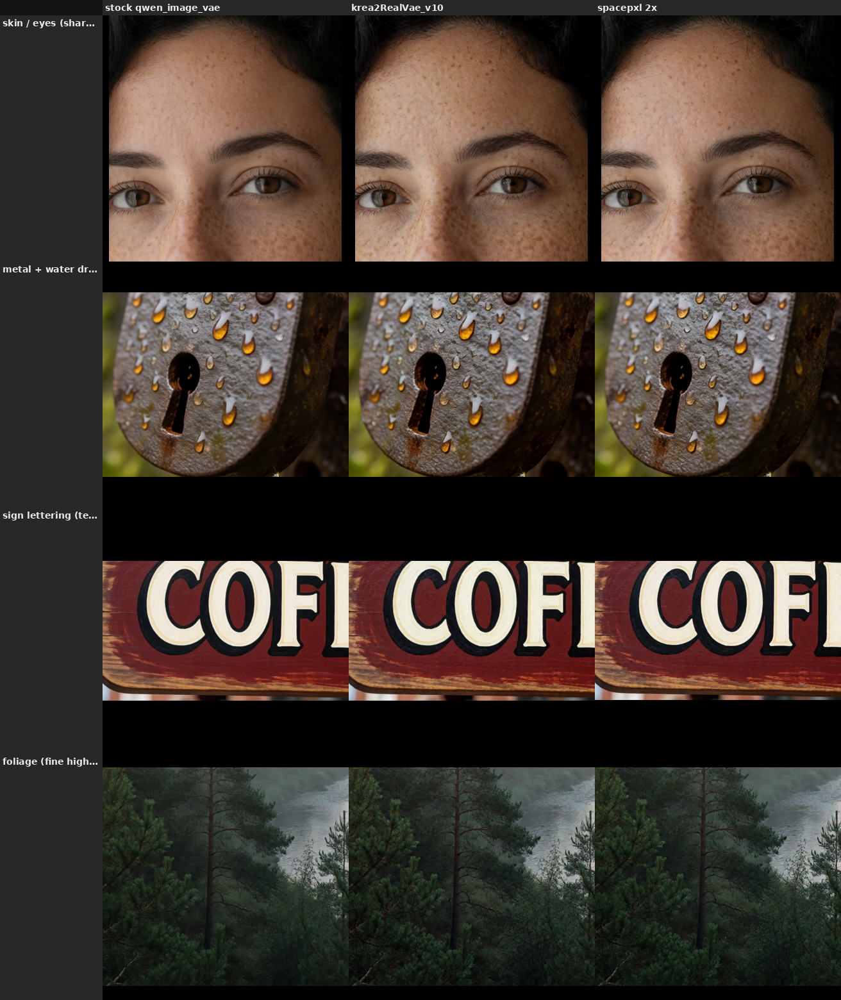

Last updated: 2026-06-29

# Choosing a VAE for Krea 2

Krea 2's stock VAE is the weak link for photoreal work. This explains why, what the better options are, and what we measured off the weights. The toolkit defaults to a drop-in community VAE and falls back to the stock one when it is not installed.

## Why the stock VAE is soft

Krea 2 ships with the Qwen-Image VAE (`qwen_image_vae`). Reading the weights shows what it is: a **Wan 2.1 VAE with the encoder frozen and only the decoder finetuned** — and that finetune was done on text-rich documents (PDFs, slides, posters) to make small text legible. That training deliberately smooths texture and fine detail, which is the wrong trade for skin, fur and foliage. So the stock decoder looks soft on photoreal images. It is not broken; it is tuned for a different goal.

We confirmed this from the files: the stock VAE's encoder is byte-identical to the Wan 2.1 VAE encoder, and only the decoder weights differ.

## The better decoders

All three options below reuse the same Wan-family architecture and decode the same Krea 2 latent. They differ only in the decoder.

- **krea2RealVae (the toolkit default).** A community decoder finetune that drops in through the stock VAE loader — no custom node. It is crisper on skin and texture than the stock VAE. This is what `generate.py` and the canonical workflows use by default.
- **spacepxl Wan2.1-VAE-upscale2x.** The same detail-finetuned decoder, but with a 12-channel sub-pixel output head that decodes at 2x resolution. It needs the `ComfyUI-VAE-Utils` node (its decode node runs the pixel-shuffle the extra channels require) — the stock decoder cannot read its 12-channel output.
- **PiD (pixel diffusion decoder, NVIDIA).** Not a VAE — a small pixel-space diffusion model that replaces the decoder and super-resolves the latent to 4x in a few steps. It is the highest quality and the heaviest (a separate 1.3B model, its own text encoder, and roughly 15 GB of VRAM at 4 megapixels). Documented here for completeness; not the toolkit default.

## How krea2RealVae was built

It is **spacepxl's upscale2x decoder with the 2x dropped**. The author averaged the upscale2x decoder's 12-channel sub-pixel head back to 3 channels (averaging the four sub-pixel groups, which is the same as downscaling the 2x output to 1x) and merged that decoder into the original VAE. The result is a plain 3-channel VAE that carries the detail-finetuned decoder and needs no custom node.

We verified this from the weights: krea2RealVae's encoder matches the original, its decoder body matches spacepxl's upscale2x decoder, and its 3-channel output head matches the averaged 12-channel head — a 12-fold closer match than the stock decoder. So at 1x output krea2RealVae gives the upscale2x quality without the 2x; use spacepxl's directly through the custom node if you want the genuine 2x resolution.

## Which to use

- **Default (photoreal, drop-in):** krea2RealVae. The toolkit selects it automatically and falls back to the stock `qwen_image_vae` if it is not installed.
- **Want 2x resolution:** spacepxl Wan2.1-VAE-upscale2x through `ComfyUI-VAE-Utils`.
- **Want the most detail and have the VRAM:** PiD.
- **Text or document images:** the stock VAE is the right choice — its decoder is tuned for legible small text.

## What we measured

We ran a decoder-isolation test on 2026-06-29: generate one latent per prompt, then decode that same latent through each VAE, so only the decoder changes. 4 benign prompts (a portrait, a macro metal shot, a cafe sign, a forest), 2 seeds, matched native-resolution crops.

The result is a modest but consistent win for krea2RealVae over stock. It is a little crisper on skin, freckles and foliage, and about level on the metal, and the direction holds across both seeds. It does not soften the sign lettering, so the default costs nothing on text at that size. spacepxl matches krea2RealVae at the same display size — its gain is the native 2x, so reach for it only when you want 2x output. Any color or contrast shift from the channel averaging is negligible. The differences are small at 8 steps; a more converged 28-step latent carries more fine detail, so the gap may be wider there (not yet run).

## Confidence and what is still open

Medium. The build reverse-engineering is exact (measured from the weights), and the stock-versus-krea2RealVae ranking now has a 2-seed decoder-isolation read behind it, not just an impression. Still open: a true round-trip test (encode a real image, decode it, compare to the original across VAEs), the same comparison on a 28-step RAW latent, and a harder text case (small or dense lettering, where the stock decoder's text finetune should help most). See [findings.md](findings.md) for the conditioning-side work this sits alongside.
