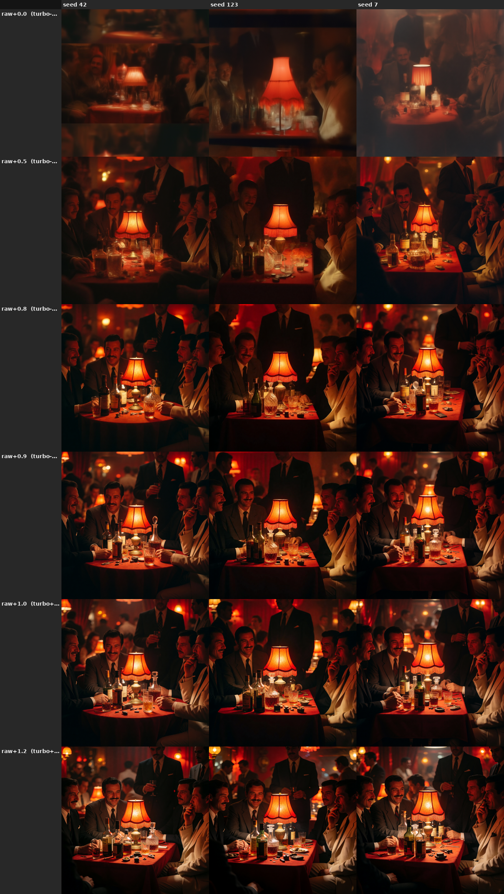
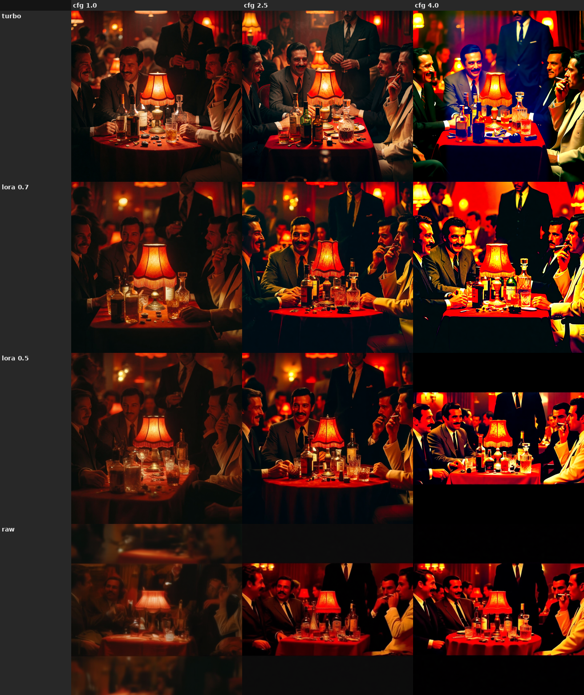
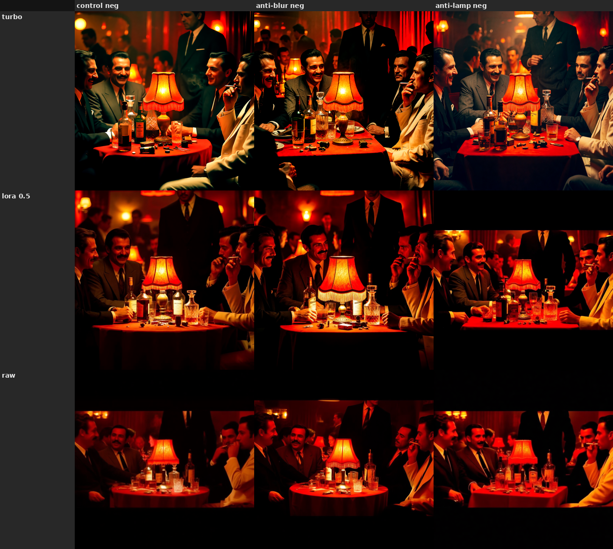
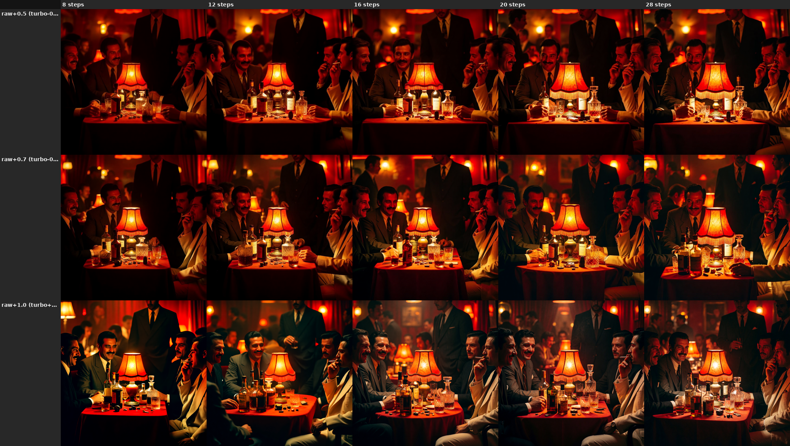

Last updated: 2026-06-28

# The Turbo-LoRA strength dial (de-distillation lever)

Krea 2 ships a RAW (pre-distillation) checkpoint and a Turbo (8-step distilled) checkpoint, plus a
**Turbo LoRA** that *is* the distillation delta: `Turbo ≈ RAW + 1.0·delta` (the LoRA was merged at -1.0 to
cancel distillation during training). So the LoRA strength is a continuous **de-distillation dial**, and the
two checkpoints are the same model at two points on it. The strength can be read from either end:

> **`RAW + s·LoRA  ≡  Turbo + (s−1)·LoRA`**

| RAW frame (`s`) | Turbo frame (`s−1`) | what it is |
|---|---|---|
| 0.0 | −1.0 | pure RAW (distillation fully removed) |
| 0.5 | −0.5 | half-distilled |
| 0.8 / 0.9 | −0.2 / −0.1 | lightly de-distilled (community "works nice" values) |
| 1.0 | 0.0 | Turbo |
| 1.2 | +0.2 | slightly over-distilled |

This doc characterizes what moving along that dial does. **Confidence: low–medium** — one prompt
(`examples/test_prompts/nightclub.txt`), a few seeds, fp8 checkpoints, visual read on a 24 GB card. Treat as
orientation, not calibrated numbers. Probes are throwaway scripts over `scripts/generate.build_graph` (no
committed tooling); grids are gitignored under `data/`, the figures here are the saved copies.

## 1. At Turbo's native config (8 steps, cfg 1), the dial is a quality ramp

*Rows = strength; cols = seed (42 / 123 / 7); 8 steps, cfg 1.*

- **Below ~0.8 the image is soft/washed at cfg 1** — RAW (0.0) at 8 steps is unusable (under-denoised), 0.5
  is hazy. The fix is *cfg>1, not more steps* (§4): at cfg ≥ 2.5, 0.5–0.7 is already sharp at 8 steps.
- **~0.8–1.2 (Turbo −0.2 … +0.2) is the usable band** and matches the community's "nice low values":
  - **0.8 / 0.9** (Turbo −0.2 / −0.1): sharp, slightly **softer / warmer / more open** than Turbo.
  - **1.0**: baseline Turbo — sharpest contrast, but same-seed compositions are near-identical (the
    distillation diversity collapse).
  - **1.2** (Turbo +0.2): **punchier / more saturated**, more table detail — over-distillation *adds pop*
    here rather than breaking (it only breaks at high cfg, §2).
- **Seed diversity rises as strength falls** (RAW seeds differ a lot; Turbo seeds barely) — but in the usable
  0.8–1.0 band the diversity difference is marginal at 8 steps. (A dedicated diversity-distillation test —
  base-model-for-the-first-step, arXiv:2503.10637 — was a **null** on Krea 2's flow schedule; only this
  global-strength axis moves diversity. Recorded internally, not pursued.)

## 2. Lower strength restores cfg>1 / negative-prompt headroom

*Rows = strength; cols = cfg (1.0 / 2.5 / 4.0); 16 steps; negative = "table lamp, lampshade, glowing light".*

Turbo is distilled to run CFG-disabled (cfg 1, no negative). Backing the strength off restores guidance:

- **Turbo (1.0) burns out above cfg ~2.5** — blown highlights, oversaturated faces at cfg 4 (the classic
  distilled-model-breaks-at-high-cfg failure).
- **0.7 / 0.5 / RAW tolerate cfg 4** (more contrast/guidance, no burn) — i.e. **CFG headroom grows as
  strength drops**.
- **RAW (0.0) *requires* cfg>1** — washed out at cfg 1, only looks right at cfg ≳ 2.5.
- Practical window for a de-distilled run: **strength ~0.5, cfg ~2.5–4, ~16 steps**.

## 3. The negative branch is active but did not strongly steer

*Rows = strength; cols = negative text (control "" / anti-blur / anti-lamp); cfg 3, 16 steps, fixed seed —
so any column-wise difference is the negative branch alone.*

- The negative **is wired and does perturb** the output at cfg>1 (columns differ at every strength), so
  cfg>1 makes the uncond path live.
- But **targeted suppression failed** — the anti-lamp negative never removed the lamp, at any strength, and
  anti-blur showed little (cfg 3 is already sharp). The effect is mild perturbation, not decisive content
  removal, and not obviously stronger at low strength.
- **Caveat / inconclusive:** the test target (the lamp) is *over-described in the positive prompt* (~30
  words), so a short negative can't win. Whether the negative steers cleanly at partial-distill is still
  open — needs a target that is **not** in the positive (see follow-ups).

## 4. The recovery lever for low strength is cfg, not steps

*Rows = strength (RAW frame); cols = steps (8 / 12 / 16 / 20 / 28); cfg 2.5, fixed seed.*

I expected de-distilled strengths to need more steps to reach Turbo sharpness. They don't — **at cfg 2.5,
strength 0.5 and 0.7 are already sharp at 8 steps**, and 12→28 steps add only marginal refinement, not a
quality jump. The softness at strength 0.5 in §1 was a **cfg-1 artifact, not a step deficiency**: turning
cfg up (not steps) recovers detail at lower strength.

Practical consequence: **`strength ~0.5–0.7, cfg ~2.5, 8 steps`** gives a sharp image that *also* has cfg /
negative-prompt headroom — the flexibility of a less-distilled model at near-Turbo speed, no extra steps.
(Caveat: one prompt/seed; a step-dependent gain could still show on finer-detail prompts.)

## Practical recipe

| Goal | Strength (RAW / Turbo frame) | steps / cfg |
|---|---|---|
| Default fast + sharp | 1.0 / Turbo | 8 / 1 |
| Softer, warmer, a little more open | 0.8–0.9 / Turbo −0.2…−0.1 | 8 / 1 |
| Punchier, more saturated | 1.2 / Turbo +0.2 | 8 / 1 |
| Need cfg>1 or negative prompts | ~0.5–0.7 / Turbo −0.5…−0.3 | **8** / 2.5–4 (steps don't help; cfg does) |
| Max seed diversity (quality cost) | 0.0–0.5 / Turbo −1.0…−0.5 | needs cfg>1 (8 steps OK at cfg ≥ 2.5) |

## Open follow-ups

- **Sigmas / scheduler** (not step *count*) are still unmapped — §4 answered steps (cfg recovers quality,
  steps barely move it), but a custom sigma schedule or a different scheduler at low strength is untested.
- **Clean negative test**: repeat §3 with a target absent from the positive (or an empty-vs-strong negative
  on a washed-out low-strength/low-cfg image where there's headroom to see).
- **bf16 / other prompts**: fp8 RAW grained less here than an earlier note warned; re-check on bf16 and on
  non-"lamp-dominated" prompts.
- **Quantify** instead of eyeballing (sharpness/contrast metric across the dial; the per-cell folders are
  already laid out for it).
