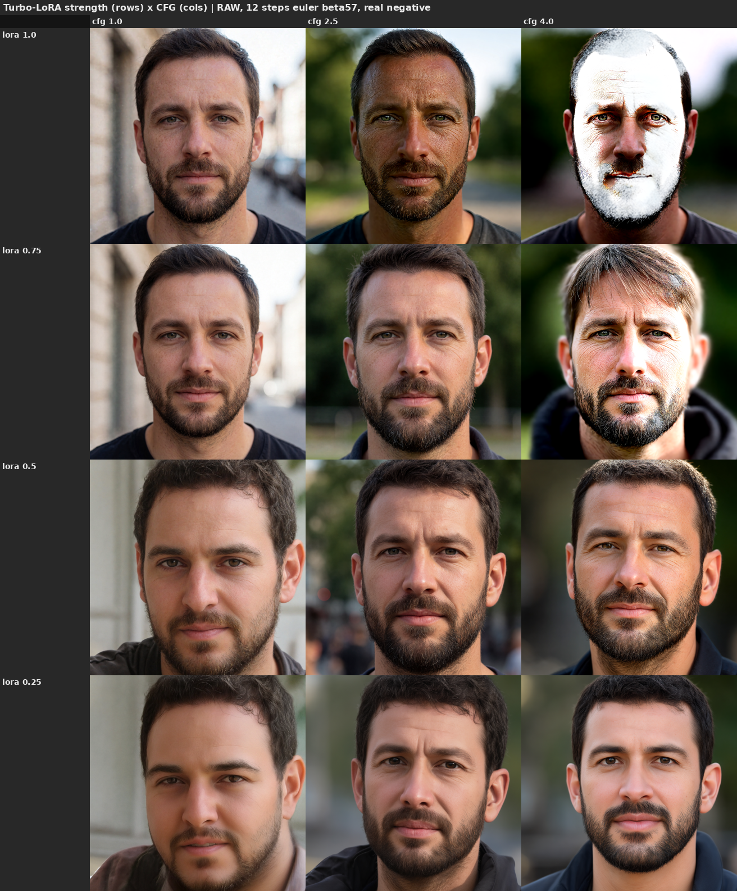
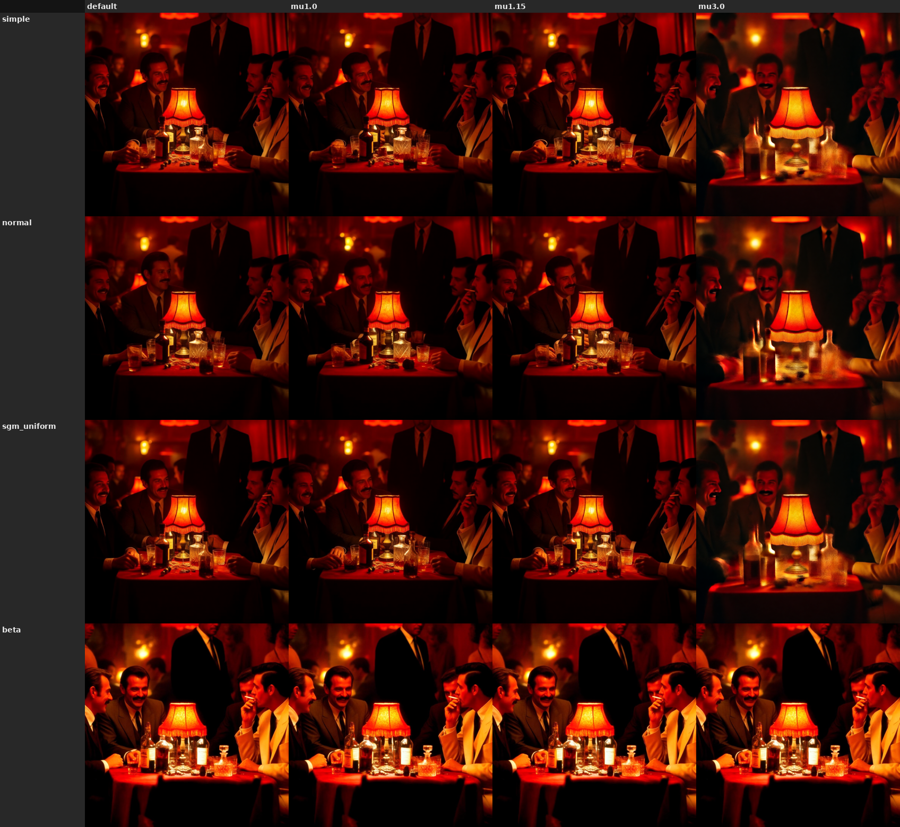

Last updated: 2026-06-29

# The Turbo-LoRA strength dial (de-distillation lever)

Krea 2 ships a RAW (pre-distillation) checkpoint and a Turbo (8-step distilled) checkpoint, plus a
**Turbo LoRA** that *is* the distillation delta: `Turbo ≈ RAW + 1.0·delta` (the LoRA was merged at -1.0 to
cancel distillation during training). So the LoRA strength is a continuous **de-distillation dial**, and the
two checkpoints are the same model at two points on it. The strength can be read from either end:

> **`RAW + s·LoRA  ≡  Turbo + (s−1)·LoRA`**

| RAW frame (`s`) | Turbo frame (`s−1`) | what it is |
|---|---|---|
| 0.0 | −1.0 | pure RAW (distillation fully removed) |
| 0.5 | −0.5 | half-distilled |
| 0.8 / 0.9 | −0.2 / −0.1 | lightly de-distilled (community "works nice" values) |
| 1.0 | 0.0 | Turbo |
| 1.2 | +0.2 | slightly over-distilled |

This doc characterizes what moving along that dial does. **Confidence: low–medium** — visual read on a 24 GB
card, orientation not calibrated numbers. The **headline (sweet spot, negative mechanism, diversity
correction) is from a 2026-06-29 open-scene re-run — see the Update below**; §1–§5 are the original
dense-prompt characterization (`examples/test_prompts/nightclub.txt`, a few seeds, fp8). Probes are throwaway
scripts over `scripts/generate.build_graph`; grids are gitignored under `data/`, the figures here are saved copies.

## Update 2026-06-29 — open-scene re-run (sweet spot · negative mechanism · diversity correction)

Re-ran the dial on an **open scene with a subject** (replacing the single dense prompt). Three refinements:

**Which config (quality vs compute).** Quality plateaus fast, and the whole useful range stays at **cfg 1**
(ComfyUI skips the uncond pass there → half the compute). `s0.8 / 8 steps / cfg 1` is the efficiency pick
(matches Turbo at 8 evals); `s0.6 / 12 steps / cfg 1` is the best all-rounder (a touch more detail and seed
headroom for 1.5× compute). cfg > 1 only earns its 2–7× when you need CFG/negative steering, not for "more
quality." This supersedes §1's "usable band 0.8–1.2" framing (which conflated quality with cfg-1 softness).

*Quality vs compute. Quality plateaus early and the useful range stays at cfg 1; cfg > 1 (C/RAW) only earns its
2–7× for guidance, not quality.*

**CFG headroom grows as strength drops.** Turbo (s1.0) burns above cfg ~2.5 — at cfg 4 the face goes
blown-white; s0.5 and RAW tolerate cfg 4 cleanly. So cfg > 1 is only usable once strength drops below ~0.8.

*Rows = strength, cols = cfg. The burn (top-right, s1.0/cfg4) clears down the rows — cfg headroom grows as
strength drops.*

**The negative is inert at cfg 1 — use a real empty negative, never `ConditioningZeroOut`.** At cfg 1 the
uncond pass is skipped, so a real negative and `ConditioningZeroOut` are byte-identical; the negative only acts
at cfg > 1 (and even there is a weak semantic lever, §3). The catch: **`_cfg_pp` samplers use the uncond even
at cfg 1**, and `ConditioningZeroOut` feeds them a degenerate uncond → grain. This sharpens §3.

*At cfg 1 the uncond is skipped for plain euler (cols 1–2 identical), but `_cfg_pp` samplers still use it, and
`ConditioningZeroOut` hands them a degenerate uncond → the only grainy cell (col 3). Use a real empty negative.*

**Diversity correction (supersedes §1's "seed diversity rises as strength falls").** Uniform de-distillation
strength is **not** a universal diversity lever: on an **open scene Turbo already varies** across seeds (flat
~45–48 as strength drops 1.0→0.6). Only *constrained/dense* prompts collapse under Turbo. The genuine free
diversity lever is the **per-stage split**, not uniform strength — see
[`two_sampler_split.md`](two_sampler_split.md).

The §1–§5 figures below are the original dense-prompt runs; §2 (cfg headroom), §4 (steps) and §5 (scheduler)
remain valid, while §1's diversity claim and §3's "active but weak" are superseded by the notes above.

## 1. At Turbo's native config (8 steps, cfg 1), the dial is a quality ramp

*Rows = strength; cols = seed (42 / 123 / 7); 8 steps, cfg 1.*

- **Below ~0.8 the image is soft/washed at cfg 1** — RAW (0.0) at 8 steps is unusable (under-denoised), 0.5
  is hazy. The fix is *cfg>1, not more steps* (§4): at cfg ≥ 2.5, 0.5–0.7 is already sharp at 8 steps.
- **~0.8–1.2 (Turbo −0.2 … +0.2) is the usable band** and matches the community's "nice low values":
  - **0.8 / 0.9** (Turbo −0.2 / −0.1): sharp, slightly **softer / warmer / more open** than Turbo.
  - **1.0**: baseline Turbo — sharpest contrast, but same-seed compositions are near-identical (the
    distillation diversity collapse).
  - **1.2** (Turbo +0.2): **punchier / more saturated**, more table detail — over-distillation *adds pop*
    here rather than breaking (it only breaks at high cfg, §2).
- **Seed diversity rises as strength falls** — *[superseded by the 2026-06-29 Update: true only on this
  constrained/dense prompt; on open scenes Turbo already varies across seeds]*. (RAW seeds differ a lot; Turbo
  seeds barely here, but in the usable 0.8–1.0 band the difference is marginal at 8 steps.) (A dedicated
  diversity-distillation test —
  base-model-for-the-first-step, arXiv:2503.10637 — was a **null** on Krea 2's flow schedule; only this
  global-strength axis moves diversity. Recorded internally, not pursued.)

## 2. Lower strength restores cfg>1 / negative-prompt headroom

*Rows = strength; cols = cfg (1.0 / 2.5 / 4.0); 16 steps; negative = "table lamp, lampshade, glowing light".*

Turbo is distilled to run CFG-disabled (cfg 1, no negative). Backing the strength off restores guidance:

- **Turbo (1.0) burns out above cfg ~2.5** — blown highlights, oversaturated faces at cfg 4 (the classic
  distilled-model-breaks-at-high-cfg failure).
- **0.7 / 0.5 / RAW tolerate cfg 4** (more contrast/guidance, no burn) — i.e. **CFG headroom grows as
  strength drops**.
- **RAW (0.0) *requires* cfg>1** — washed out at cfg 1, only looks right at cfg ≳ 2.5.
- Practical window for a de-distilled run: **strength ~0.5, cfg ~2.5–4, ~16 steps**.

## 3. The negative branch is active but did not strongly steer *(sharpened by the 2026-06-29 Update: inert at cfg 1; use a real empty negative, never `ConditioningZeroOut`)*

*Rows = strength; cols = negative text (control "" / anti-blur / anti-lamp); cfg 3, 16 steps, fixed seed —
so any column-wise difference is the negative branch alone.*

- The negative **is wired and does perturb** the output at cfg>1 (columns differ at every strength), so
  cfg>1 makes the uncond path live.
- But **targeted suppression failed** — the anti-lamp negative never removed the lamp, at any strength, and
  anti-blur showed little (cfg 3 is already sharp). The effect is mild perturbation, not decisive content
  removal, and not obviously stronger at low strength.
- **Caveat / inconclusive:** the test target (the lamp) is *over-described in the positive prompt* (~30
  words), so a short negative can't win. Whether the negative steers cleanly at partial-distill is still
  open — needs a target that is **not** in the positive (see follow-ups).

## 4. The recovery lever for low strength is cfg, not steps

*Rows = strength (RAW frame); cols = steps (8 / 12 / 16 / 20 / 28); cfg 2.5, fixed seed.*

I expected de-distilled strengths to need more steps to reach Turbo sharpness. They don't — **at cfg 2.5,
strength 0.5 and 0.7 are already sharp at 8 steps**, and 12→28 steps add only marginal refinement, not a
quality jump. The softness at strength 0.5 in §1 was a **cfg-1 artifact, not a step deficiency**: turning
cfg up (not steps) recovers detail at lower strength.

Practical consequence: **`strength ~0.5–0.7, cfg ~2.5, 8 steps`** gives a sharp image that *also* has cfg /
negative-prompt headroom — the flexibility of a less-distilled model at near-Turbo speed, no extra steps.
(Caveat: one prompt/seed; a step-dependent gain could still show on finer-detail prompts.)

## 5. The sigma *schedule* (scheduler + flow shift) is a weak lever here

*Rows = scheduler; cols = flow shift mu (default 0.5/1.15 · mu1.0 · mu1.15 · mu3.0); strength 0.5, cfg 2.5,
8 steps, fixed seed — so any cell difference is the schedule *shape* alone.*

§4 answered step *count* (cfg recovers quality, steps barely move it). This closes the other schedule axis —
where the sigmas land, not how many — at the de-distilled regime (strength 0.5, cfg 2.5, 8 steps):

- **Scheduler family barely matters.** `simple` / `normal` / `sgm_uniform` are near-identical — same
  composition, same sharpness. **`beta` is the one outlier**: a distinct reframing (figures lean in, tighter
  crop, brighter/more saturated). So among the common schedulers, only `beta` is a real knob, and it changes
  *composition*, not quality.
- **Flow shift mu only moves things at the extreme.** `default` / `mu1.0` / `mu1.15` are near-identical;
  **`mu3.0` brightens and blooms** (more time spent at high noise → softer highlights, lifted exposure). So
  the de-distilled regime is *not* especially sensitive to mu until you push it far.
- **Takeaway:** at strength 0.5 / cfg 2.5 / 8 steps the schedule shape is a **weak** lever — the strength and
  cfg dials (§1–§4) dominate. Reach for `beta` if you want a composition reroll, or `mu3.0` for a brighter/
  softer look; otherwise the default schedule is fine. **This closes the sigmas/scheduler follow-up.**

## Practical recipe

| Goal | Strength (RAW / Turbo frame) | steps / cfg |
|---|---|---|
| Default fast + sharp | 1.0 / Turbo | 8 / 1 |
| Softer, warmer, a little more open | 0.8–0.9 / Turbo −0.2…−0.1 | 8 / 1 |
| Punchier, more saturated | 1.2 / Turbo +0.2 | 8 / 1 |
| Need cfg>1 or negative prompts | ~0.5–0.7 / Turbo −0.5…−0.3 | **8** / 2.5–4 (steps don't help; cfg does) |
| Max seed diversity (quality cost) | 0.0–0.5 / Turbo −1.0…−0.5 | needs cfg>1 (8 steps OK at cfg ≥ 2.5) |

## Open follow-ups

- **Clean negative test**: repeat §3 with a target absent from the positive (or an empty-vs-strong negative
  on a washed-out low-strength/low-cfg image where there's headroom to see).
- **bf16 / other prompts**: fp8 RAW grained less here than an earlier note warned; re-check on bf16 and on
  non-"lamp-dominated" prompts.
- **Quantify** instead of eyeballing (sharpness/contrast metric across the dial; the per-cell folders are
  already laid out for it).
