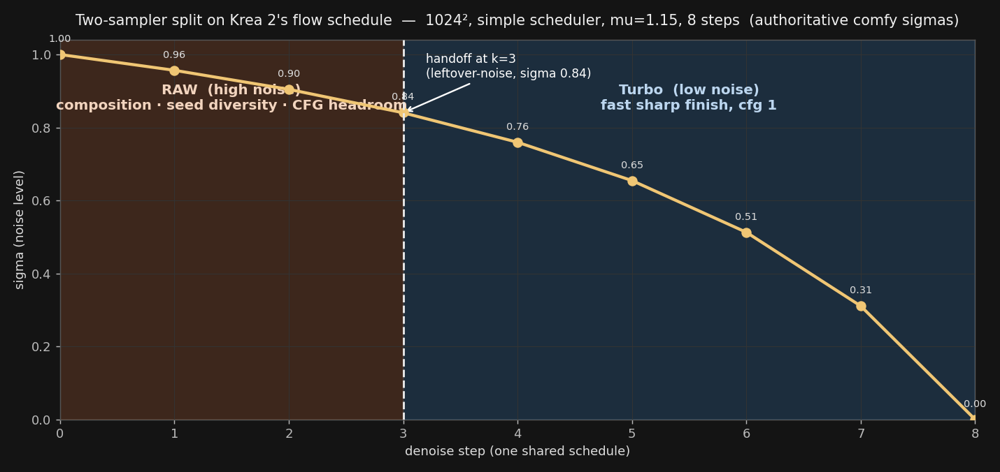
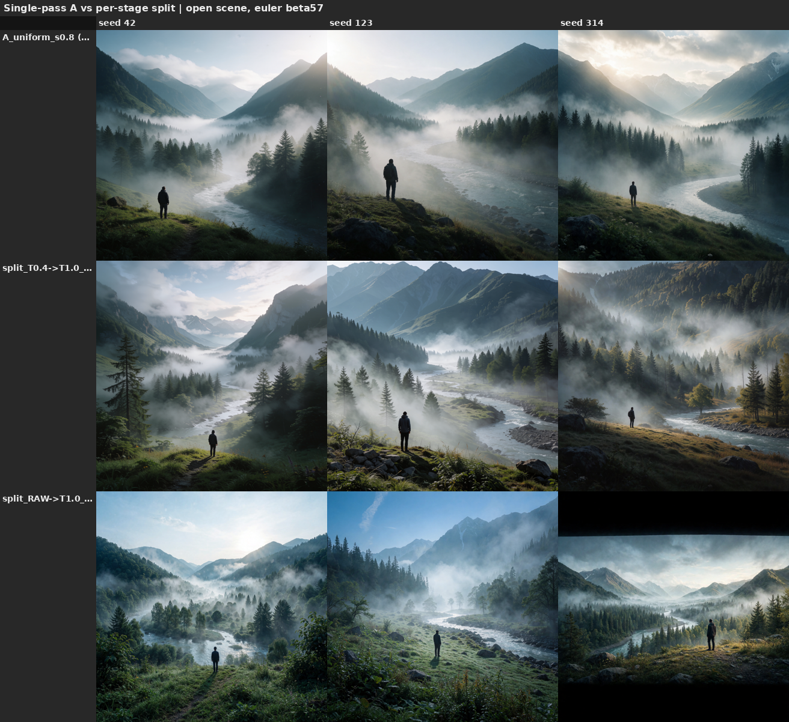
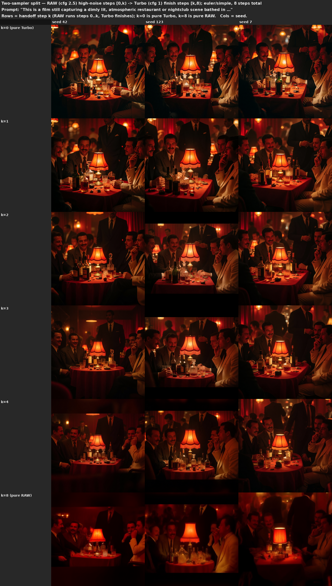
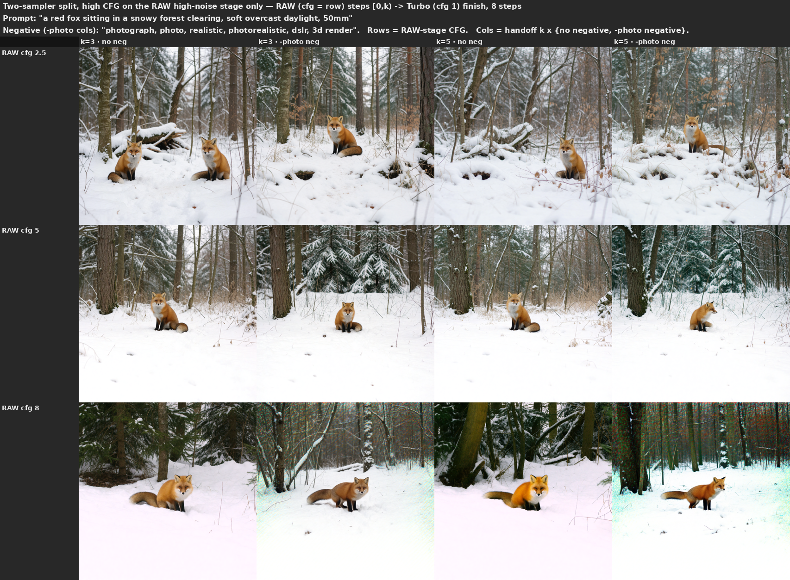
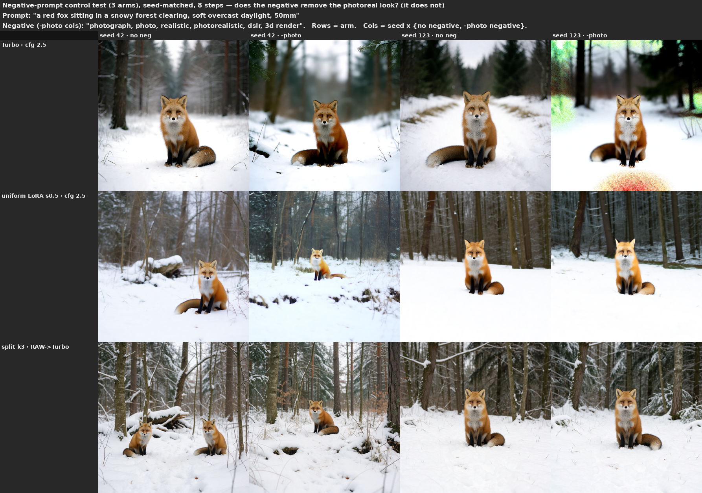

Last updated: 2026-06-29

# Two-sampler split (RAW high-noise → Turbo low-noise)

Run **two models on one denoise**: a high-noise model for the first `boundary` steps, a low-noise model for
the rest, on a single shared flow-shifted schedule. The handoff is the standard ComfyUI leftover-noise
pattern — stage 1 (`KSamplerAdvanced`, `add_noise=enable`, `return_with_leftover_noise=enable`) denoises
`[0, boundary)` and passes its partially-denoised latent to stage 2 (`add_noise=disable`) which finishes
`[boundary, steps)`.

For Krea 2 the natural pairing is **RAW for the high-noise steps → Turbo for the finish**: RAW owns
composition/diversity/CFG-response (the high-noise regime), Turbo owns the fast sharp finish (the low-noise
regime). Builder: `scripts/generate.build_split_graph` (tests: `tests/test_split_graph.py`).

> Precedents: **Wan 2.2** splits two full experts at an SNR boundary (≈0.875 normalized timestep); **LTX-2**
> renoises to sigma≈0.9 and finishes with a distilled LoRA. This is the same idea at our two endpoints — the
> Turbo LoRA *is* the distillation delta, so RAW→Turbo is the de-distilled-start / distilled-finish split.



*The schedule both stages share (authoritative comfy sigmas). Because the flow shift front-loads the schedule,
a handoff at **k=3 is still sigma ≈ 0.84** — RAW shapes only the coarsest high-noise structure before Turbo
takes over, which is why a *small* k already moves diversity and why the usable boundary is low.*

```python
from generate import build_split_graph, run            # scripts/ on sys.path
g = build_split_graph(prompt,
    unet_high="krea2_raw_fp8_scaled.safetensors",       # high-noise stage: composition + guidance
    unet_low="krea2_turbo_fp8_scaled.safetensors",      # low-noise stage: fast sharp finish
    clip=..., vae=..., boundary=3, steps=8,
    cfg_high=2.5, cfg_low=1.0, negative="", seed=42)
```

`boundary` is the handoff step (must be `0 < boundary < steps`). `cfg_high` drives the RAW stage (real
negative when >1); `cfg_low` the Turbo finish (1 = CFG-off, the Turbo native). Pass `lora_low=<turbo LoRA>`
to use one RAW checkpoint + the Turbo LoRA on the finish instead of loading a second checkpoint.

**Confidence: low–medium** overall (one or two prompts, ≤3 seeds, fp8, visual read on a 24 GB card; orientation,
not calibrated numbers) — **medium** on the diversity result after the open-scene re-run below (n=2 scenes).
Probes are throwaway scripts over the builder; grids are gitignored under `data/`, the figures here are saved copies.

## Update 2026-06-29 — open-scene re-run (corrects the diversity claim)

The original §1 read ("Turbo collapses seed diversity") was measured on **constrained/dense** prompts. Re-running
on an **open scene** splits the diversity story into two mechanisms:

- **Uniform de-distillation strength is not a universal diversity lever.** On an open scene Turbo *already*
  varies across seeds — cross-seed difference is flat (~45–48) as strength drops 1.0→0.6 (the 0.4 uptick is
  softness, not new composition). Only constrained/dense prompts collapse under Turbo, so lowering strength
  trades CFG headroom and detail, not variety.


*Uniform strength on an open scene: cross-seed diversity is flat (~45–48) from 1.0→0.6 — strength alone is not a
diversity lever here. (Pixel-diff metric; it saturates on busy scenes.)*

- **The per-stage split is a genuine free diversity lever, even on open scenes.** Low-strength (or RAW)
  high-noise → full-Turbo finish re-rolls composition across seeds at **cfg 1 and the same 8-eval cost** as
  single-pass, quality held — the variety comes from the split's high-noise composition phase. Visually
  consistent on 2 scene types (landscape + street). A strong candidate for the recommended default when you
  want seed variety; single-pass Turbo is the simpler fallback.



*Rows = single-pass A vs two splits; cols = seed. The cfg-1 `T0.4→T1.0` split (middle) adds cross-seed
composition variety at single-pass cost — the free-diversity pick. (RAW→T1.0 at cfg 2.5 varies too but costs
more and can letterbox, e.g. seed 314.)*

Open follow-up: a composition-aware diversity metric — pixel-diff saturates on busy scenes (single-pass and
split market-street rows both ~63 despite the split being visibly more varied). The §1–§3 figures below are the
original dense/fox-prompt runs; they remain valid for the CFG-headroom (§2) and negative (§3) reads, which the
re-run did not change.

## 1. What it buys: seed/compositional diversity at near-Turbo quality (on constrained prompts)



*Rows = boundary `k` (k0 = pure Turbo control, k8 = pure RAW control); cols = seed. 8 steps total.*

- **Turbo collapses seed diversity *on this constrained/dense prompt*** (top row: three seeds, near-identical
  compositions; see the Update above — open scenes already vary). Letting RAW form the high-noise steps restores
  it — by **k2–k3 the three seeds diverge** in framing/pose/composition while staying sharp.
- **The Turbo finish rescues RAW's low-step under-denoising.** Pure RAW at 8 steps (bottom row) is dark/hazy;
  but k1–k3 are Turbo-sharp — the low-noise stage cleans up RAW's coarse start.
- **Sweet spot ≈ k2–3 of 8.** Past k4 the RAW tone bleeds in (warmer/darker). So you get RAW's compositional
  variety with Turbo's sharpness and roughly Turbo's speed.

## 2. Clean CFG headroom on the high-noise stage



*Rows = RAW-stage cfg (2.5 / 5 / 8); cols = boundary k3/k5 × {base, strong style negative}; fox prompt.*

Turbo burns above cfg ~2.5. The split runs the high cfg **only on the RAW high-noise steps**, then Turbo
finishes at cfg 1 — so **cfg up to ~5 on the RAW stage stays clean** (rows 1–2, no burn), giving real
prompt-adherence headroom that neither pure Turbo nor a uniform low-strength de-distill can. **cfg 8 is past
the clean ceiling** (row 3: chromatic-noise artifacts, worse at k5).

## 3. What it does *not* buy: negative-prompt control



*Three arms (Turbo cfg2.5 / uniform s0.5 / split) × {empty, strong style negative}; the negative never flips the photoreal look.*

Putting the negative on the high-noise steps does **not** make it bite. A negative can't override an explicit
positive mention (an anti-"mug" negative never removed a prompted mug, in any arm), and a strong global style
negative ("photograph, photoreal, …") never flips the style — at cfg 8 it only adds color artifacts, not a
style change. This holds for pure Turbo, uniform de-distill, *and* the split, and RAW is the *pre-distill*
model — so the **uncond/negative direction is just a weak semantic lever on this Qwen3-VL-conditioned model**,
not something the split (or de-distillation) restores. Use the split for diversity + CFG *headroom*, not for
negative prompting.

## Practical recipe

| Goal | high / low | boundary | steps / cfg |
|---|---|---|---|
| Diversity + Turbo sharpness | RAW / Turbo | k2–3 | 8 / cfg_high 2.5, cfg_low 1 |
| + prompt-adherence headroom | RAW / Turbo | k3 | 8 / cfg_high ≤5, cfg_low 1 |
| One checkpoint (LoRA finish) | RAW / RAW + `lora_low`=Turbo LoRA | k2–3 | 8 / 2.5, 1 |

Avoid: `cfg_high ≥ 8` (artifacts past the clean ceiling); boundary `≥ k5` of 8 (RAW tone bleeds in, finish too
short). Negative prompting — don't rely on it (§3).

## See also

- [`findings.md`](findings.md) — the dated summary entry.
- [`turbo_lora_strength.md`](turbo_lora_strength.md) — the single-model strength dial (`RAW + s·LoRA ≡ Turbo
  + (s−1)·LoRA`); the split is the *per-step* version of moving along that dial.
